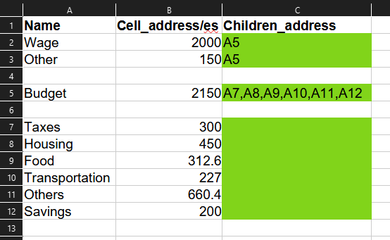

# What is a Sankey diagram?
Quoted from _Wikipedia_:

> Sankey diagrams are a data visualisation technique or flow diagram that emphasizes flow/movement/change from one state to another or one time to another.

Essentially, it is a representation of distribution of values within a system. It maintains the volume to more or less _feel_ the share of quantity with each other.

## What is this for?
The webpage https://sankeymatic.com/ provides a free tool to create your own Sankey graphs.

After starting my first job, I thought it might want to be a little better at my own personal finances, and made a template as such.

I had the idea while finishing off the basic sheet, and made this because I thought it might be a fun idea to automatically create a Sankey graph.

I thought further to load the webpage itself, paste the contents, retrieve the image, but I think this is good enough.

## Is it practical?
Maybe? You might be better off just writing the whole thing down on the website, compared to having to write your data points on the sheet. But I still think it was a fun proof of concept.

## Future updates?
Unlikely, but perhaps bug fixes if I encounter while using this myself.

## Screenshots

Example data stored on the 'Nodes' sheet

Pasted data produced from the program.

Time to complete: ~5 hours

## Acknowledgement
I would just like to say thanks to the author, Steve Bogart, for providing the website to create the Sankey diagrams,
SankeyMATIC Github repo: https://github.com/nowthis/sankeymatic